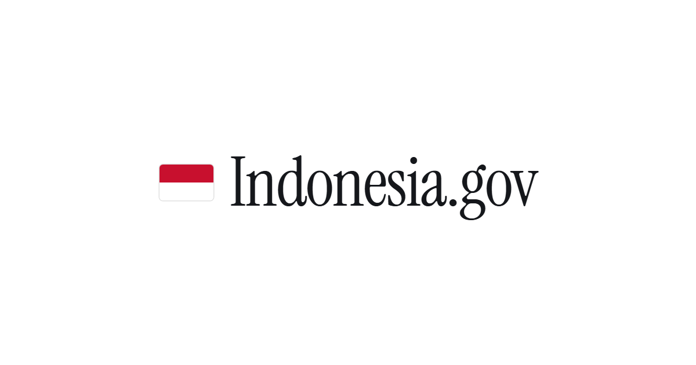
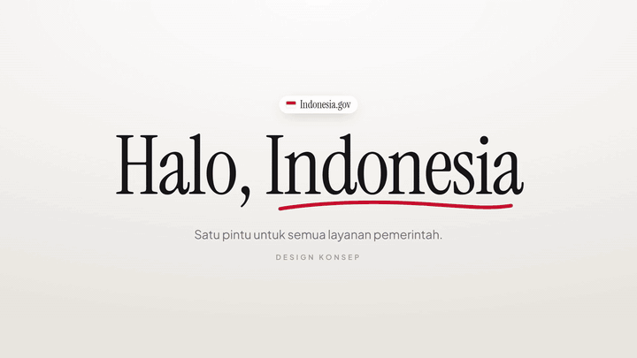
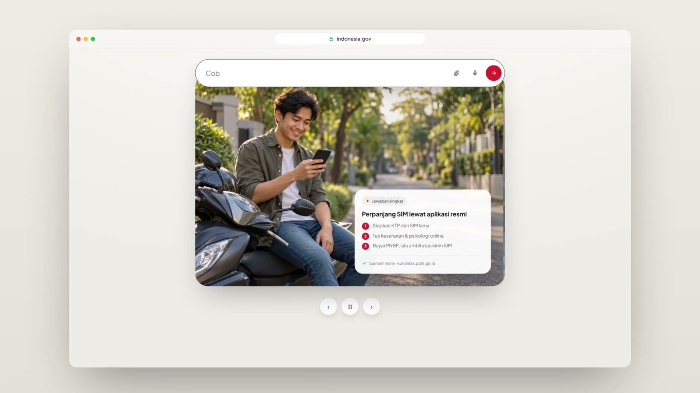
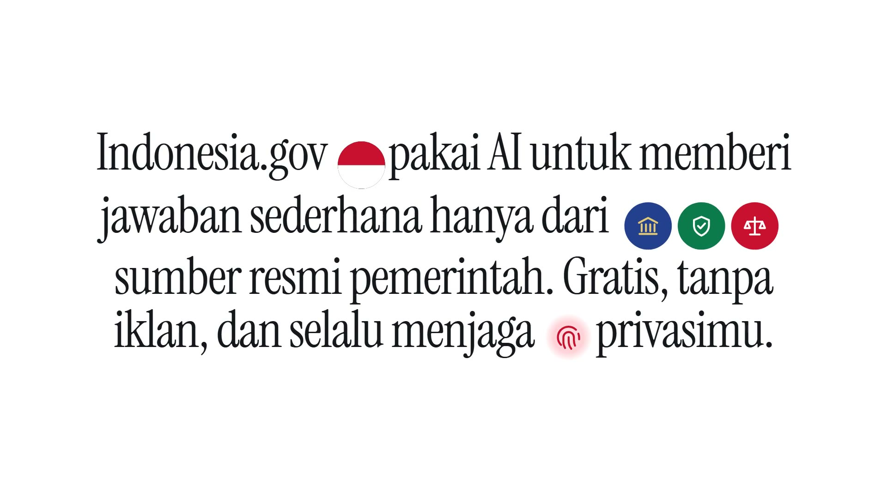
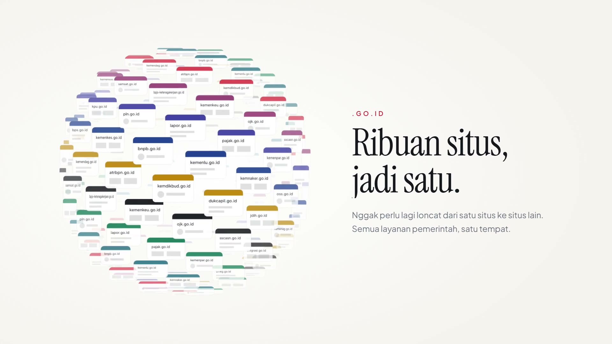
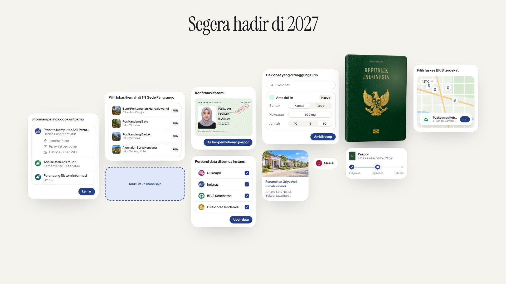
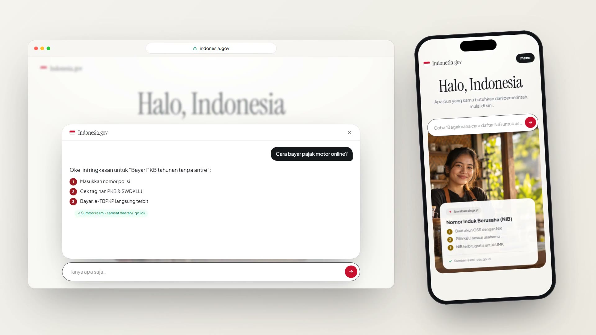
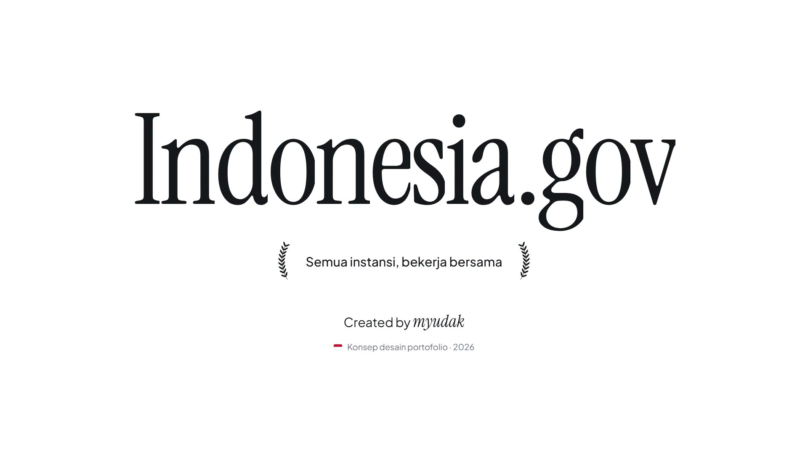
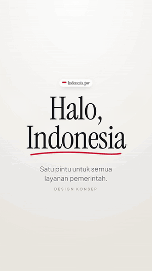

<div align="center">



### Satu pintu untuk semua layanan pemerintah.
**One front door to every government service in Indonesia: a design concept.**

[**Live site**](https://indonesia.gov.myudak.com) ·
[**Watch the reel (16:9)**](https://indonesia.gov.myudak.com/media/indonesia-gov-reel.mp4) ·
[**Watch the Reels cut (9:16)**](https://indonesia.gov.myudak.com/media/indonesia-gov-reel-vertical.mp4)


</div>

<br />

<p align="center">
  
</p>

> [!NOTE]
> **This is a portfolio design concept, not an official government website.** It isn't affiliated with the Government of the Republic of Indonesia. Every answer, form and number on the page is sample content.

---

## The idea

### What is America.gov?

[America.gov](https://america.gov) is a US government front door, powered by the U.S. General Services Administration and designed by the National Design Studio. Instead of asking people to know *which* agency handles *what*, it gives them one box: **describe what you need, in your own words**. Its core promises, as stated on the site:

- **Simple answers, only from official sources.** AI answers are drawn exclusively from federal, state and local government websites.
- **"29,000 websites into one."** No more wandering from site to site.
- **Private by default.** Personal information isn't collected or stored, and the conversation disappears when you leave.
- **No app to download.** It works in any browser, on any device.
- **More coming in 2027.** Beyond answers: completing forms, tracking progress, and organising everything in one place.

It's also beautifully made: calm serif typography, generous whitespace, real photos of real situations, and motion that explains rather than decorates.

### Why this matters even more for a bureaucratic country

Government in Indonesia is spread across dozens of ministries and agencies, 38 provinces and more than 500 regencies and cities, and each one tends to run its own website, app and login. Officials have publicly cited figures in the **tens of thousands of government applications** (around 27,000 is the number usually quoted), and the national push for integrated digital services (SPBE, Perpres 82/2023, and the GovTech initiative INA Digital) exists precisely because of that fragmentation.

For a citizen, that fragmentation shows up as everyday friction:

| The friction today | What a single front door changes |
| --- | --- |
| *"Which office handles this?"* SIM goes to the police, passports to Imigrasi, KK to Dukcapil, NIB to OSS, taxes to DJP… | Ask in plain Bahasa; the answer names the right agency and links the official source. |
| Requirements scattered across PDFs, circulars and social posts | Three clear steps, with the source shown, so the answer can be trusted and checked. |
| One more app to install for every service | Nothing to install. It's a website that works on a cheap Android phone. |
| Re-entering the same data at every agency | The "update once, everywhere" flow on the 2027 roadmap. |
| Jargon (PNBP, KBLI, SWDKLLJ, faskes…) | Answers in everyday language, jargon explained in context. |

Bureaucracy doesn't disappear, but **the citizen stops having to navigate it**. That's the promise this concept explores for Indonesia.

---

## What's in the concept

| | |
| --- | --- |
|  | **Hero: *Halo, Indonesia.*** A search bar types real questions ("Gimana cara perpanjang SIM online?") while photo slides of everyday Indonesians wipe past, each with a short, sourced answer card. |
|  | **Manifesto.** The promise reads itself word by word as you scroll; the arrow morphs into the flag, official seals pop in, and a fingerprint draws itself for privacy. |
|  | **Ribuan situs, jadi satu.** A canvas sphere of ~150 `.go.id` sites assembles as you scroll and can be dragged to spin. |
|  | **Segera hadir di 2027.** A board of future services: CPNS job matches, campsite booking at TN Gede Pangrango, passport application and tracking, updating data across agencies, BPJS medicine coverage, subsidised housing, faskes finder. |
|  | **Ask anything.** A sticky ask bar opens a chat panel that streams a short, sourced answer (demo answers). Mobile-first throughout. |
|  | **Footer.** A full-width wordmark, *Semua instansi, bekerja bersama*, and an animated author credit. |

Also: a header that hides on scroll down and slides back on scroll up (same behaviour as America.gov), Lenis smooth scrolling, full `prefers-reduced-motion` support, and link-preview metadata for WhatsApp, LinkedIn and X.

---

## The showcase videos

The motion piece is built in code with **Remotion**, reusing the site's real data and photos. It's scored to music with every scene cut landing on the beat, and comes in two cuts:

<table>
  <tr>
    <td width="68%" valign="top">
      <a href="https://indonesia.gov.myudak.com/media/indonesia-gov-reel.mp4"></a>
      <p align="center"><b>16:9 · 1920×1080 · 60fps · 30s</b><br /><a href="https://indonesia.gov.myudak.com/media/indonesia-gov-reel.mp4">▶ Watch with sound</a></p>
    </td>
    <td width="32%" valign="top">
      <a href="https://indonesia.gov.myudak.com/media/indonesia-gov-reel-vertical.mp4"></a>
      <p align="center"><b>9:16 · Reels / TikTok</b><br /><a href="https://indonesia.gov.myudak.com/media/indonesia-gov-reel-vertical.mp4">▶ Watch with sound</a></p>
    </td>
  </tr>
</table>

The vertical cut isn't a crop. Every scene recomposes for the tall frame: a full-screen phone for the hero and chat, the roadmap as a 3×2 grid, and stacked titles.

---

## Tech stack

| Layer | Choice | Used for |
| --- | --- | --- |
| Framework | [Astro 7](https://astro.build) (static) | Zero-JS-by-default pages, optimised images (`astro:assets` → responsive WebP) |
| Styling | [Tailwind CSS 4](https://tailwindcss.com) | Design tokens (`ink`, `paper`, `merah`) and layout |
| Motion | [GSAP 3](https://gsap.com): ScrollTrigger, SplitText, DrawSVG | Hero intro, scroll-scrubbed manifesto, parallax, tooltip springs |
| Scrolling | [Lenis](https://lenis.darkroom.engineering) | Smooth scroll synced to the GSAP ticker |
| Type | Instrument Serif + Plus Jakarta Sans (Fontsource) | Plus Jakarta Sans comes from an Indonesian type foundry |
| Video | [Remotion 4](https://remotion.dev) | Frame-accurate React video, rendered to H.264 |
| Hosting | [Vercel](https://vercel.com) | Auto-deploys on every push to `main` |

## Project structure

```
src/
├─ components/        Hero, Manifesto, Orbit, Features, Roadmap, ChatDock, Menu, Footer, AnimatedTooltip…
├─ data/content.ts    every example question, answer and source (shared with the video)
├─ assets/            scene photos, roadmap images, avatar (optimised at build time)
├─ scripts/motion.ts  GSAP + Lenis setup and shared scroll reveals
└─ layouts/Base.astro SEO / Open Graph / JSON-LD
video/                Remotion project: scenes, soundtrack sync, 16:9 + 9:16 compositions, OG image
docs/media/           README previews and screenshots
```

## Getting started

```bash
npm install
npm run dev        # http://localhost:4321
npm run build      # static output in dist/
```

### Render the videos

```bash
cd video
npm install
npm run studio            # scrub the timeline in Remotion Studio
npm run render:all        # → video/out/indonesia-gov-reel.mp4 + -vertical.mp4
npm run og                # regenerate the 1200×630 social image
```

Scene cuts are computed from the music's beat grid in `video/src/Soundtrack.tsx`. To swap the track, replace `video/public/music.mp3` and update the first-hit, bar-length and final-hit constants there.

---

## Credits & notes

- **Design & development:** [Muchammad Yuda Tri Ananda (myudak)](https://github.com/myudak)
- **Inspiration:** [America.gov](https://america.gov), by the U.S. General Services Administration and the National Design Studio.
- **Photos and illustrations** in the scenes and roadmap are AI-generated for this concept; the people shown are fictional.
- **Content** (steps, sources, salaries, addresses, timelines) is illustrative sample data, not official guidance. Always check the relevant agency.
- The passport cover shows Indonesia's national emblem (Garuda Pancasila) for illustrative purposes only. Its use is regulated by UU No. 24/2009, so don't reuse it commercially.

<div align="center">
<br />
<sub>Konsep desain portofolio · 2026 · bukan situs resmi Pemerintah Republik Indonesia</sub>
</div>
